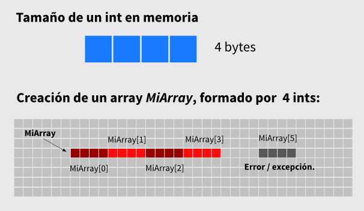
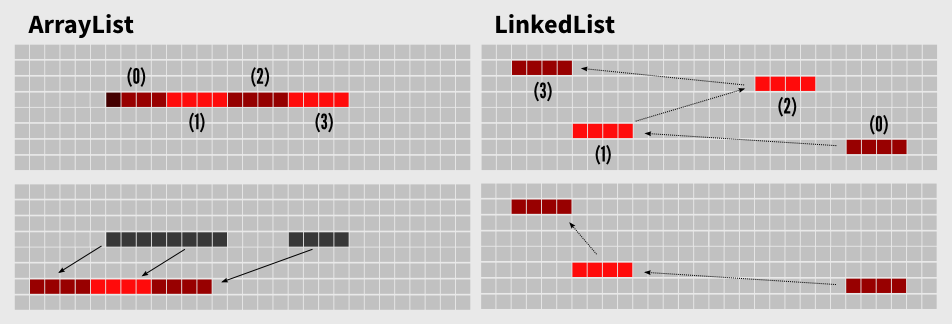

% Estructuras de Datos
% Ale
% Hangar, 5-3-2015

# Referencias

**Repo de processing con los ejercicios**
[https://github.com/Ale-/codeup]()

**Presentación**
[http://workshops.wwb.cc/data-structures]()

# ¿Qué son los datos?

Los datos son una representación lógica del estado binario en elementos físicos, es decir bits (0-1), que representan el estado de los semiconductores de un chip. Para calcular la cantidad de valores posibles en un dato tenemos que calcular las posibles combinaciones de sus bits. Es decir dos (número de valores posibles en un bit) elevado al número de bits. 1 byte tiene 8 bits así que 1 bit tiene 256 valores posibles (2 elevado a 8). 32 bits tienen 4 mil millones de valores posibles (2 elevado a 32). Por ejemplo un color en processing viene a ocupar 4 bytes significativos (la combinación de 256 valores por componente de color R, G, B, A). Es decir, en un modo de color normal hay 4 mil millones de valores posibles para el color de un pixel en nuestros sketches.

# Los tipos primitivos y los objetos

##

Java es un lenguaje orientado a objetos. Un lenguaje con orientación estricta a objetos sería Python, donde todo está encapsulado en objetos. Java no es tan estricto y tiene elementos que no son objetos, como los _tipos primitivos_. Los tipos primitivos **a diferencia de los objetos** no tienen referencias, son tan sólo **valores simples guardados en memoria**, en una zona llamada _stack_. Los nombres de los objetos no son direcciones en memoria con un valor asociado, son referencias a otro lugar en memoria llamado _heap_ donde se guarda la información del objeto. Es como si las primitivas fueran una caja donde podríamos obtener algo, mientras que en los objetos la llave y la caja serían iguales pero el contenido sería un papel con la dirección de lo que queremos obtener. Como el papel siempre cabría en la caja en este último caso lo que obtendríamos podría ser del tamaño que quisiéramos. 

Esta distinción implica un aspecto esencial de la programación en Java. Dado que los nombres de los objetos son referencias y los de las primitivas devuelven directamente valores, cuando pasamos una variable primitiva a un método pasamos su valor y no hay manera que el método modifique a la variable externa. Al contrario si pasas un objeto, pasas la referencia al lugar en la memoria donde está guardado por lo que los cambios afectan al objeto original. Los métodos en Java son una clase especial de tipos primitivos. 

## Tamaño de los tipos primitivos

* boolean 1 byte
* char 2 bytes
* int 4 bytes
* float 4 bytes
* long 8 bytes
* double 8 bytes

# Las matrices

## 

Las matrices (arrays) son 'bolsas' de memoria que guardan un grupo de valores del mismo tipo (y por lo tanto tamaño). Puede haber arrays de primitivas y de objetos (los arrays de objetos son realmente arrays de referencias a objetos). Se parecen a los objetos en que tienen referencias y se instancian con el operador __new()__. También tienen algunos métodos como length, que devuelve el número de slots que componen el array. Si ejecutamos un: <pre><code>MiArray = new int[30];</code></pre> El programa reserva en memoria un fragmento que mide 120 bytes (lo suficiente para alojar 30 números enteros), más algo de metainformación (24 bytes). Si leemos al elemento 4: <pre><code>println(MiArray[3]);</pre></code> El programa irá al origen del array en memoria, le sumará el tamaño de un elemento (4 bytes de un int) por el número de elementos previos y leerá los 4 bytes siguientes. Los arrays son muy eficientes porque esta implementación es muy sencilla y se ejecuta a muy bajo nivel. El principal incoveniente es que los arrays no son dinámicos, es decir no se puede cambiar su tamaño una vez instanciados. 
    
##




# Las clases y los objetos

Los objetos son los elementos de primer orden de la programación orientada a objetos (POO). Son **instancias de abstracciones** que denominamos _Clases_ y están compuestos por _métodos_ y _campos_. La POO es una representación lógica de modelación de problemas. En la vida real los problemas se resuelven con herramientas materiales o conceptuales, los objetos en POO. Un ejemplo de modelación podría ser un objeto (el coche de tu madre), de la clase <em>Autocar</em> que implementa la interfaz <em>Vehículo</em>. Tendría como campos otros objetos como <em>Ruedas</em>, algunas variables como <em>Velocidad</em>, algún booleano como <em>conLucesEncendidas</em> y métodos como <em>acelerar()</em> o <em>girar()</em>. En la programación en Java toda programación se encapsula dentro de clases y objetos. **Toda clase extiende a la clase Object de Java y por lo tanto hereda sus métodos**. 
       

# Las estructuras de datos

Una estructura de datos es **un objeto de Java**, instancia de una clase **diseñada para contener datos y manipularlos con propósitos específicos de manera eficiente** (a diferencia de un array, que es un contenedor genérico sin funciones especializadas.) 
    
# Las listas
    
Una primera necesidad que podemos tener es la de disponer de una estructura de datos que se pueda modificar dinámicamente, a diferencia de los arrays. A este tipo de estructuras se les denomina <em>lista</em>. Java dispone de una interfaz llamada [List](http://docs.oracle.com/javase/7/docs/api/java/util/List.html). Una interfaz se concreta específicamente en las clases que la extienden, compartiendo todas ellas una misma interfaz pública básica, la de la clase madre. En Java la clase madre para las listas es List, que se ve extendida por otras como ArrayList, LinkedList, etc. Esto permite que haya métodos compartidos y previsibles para las clases hija, como <em>get()</em> mientras que la implementación específica es privada a las subclases. 
    
#  Listas

## ArrayLists
    
La clase de lista que emplearemos más usualmente es [ArrayList](http://docs.oracle.com/javase/7/docs/api/java/util/ArrayList.html). Un ArrayList encapsula a un array normal y dispone de métodos para hacerlo crecer y decrecer a medida que lo necesitemos. Como el contenedor interior es un array es una implementación eficiente, aunque tiene limitaciones comparadas con otro tipo de listas más sofisticadas. Una escenario adverso a los ArrayLists es uno en el que tengamos que eliminar un elemento interior. Eliminar un elemento interior es problemático porque implica crear un array nuevo, copiando todos los elementos del uno al otro. Si este es el escenario de tu programa y tienes problemas de rendimiento puedes probar a usar otro tipo de lista, como una lista enlazada (LinkedList).      


## LinkedLists
    
Las listas enlazadas ([LinkedList](http://docs.oracle.com/javase/7/docs/api/java/util/LinkedList.html)) tienen un comportamiento completamente distinto al de los arraylists. Para ello funcionan un poco como los hormigueros, donde las hormigas que van en fila india a por comida, tan sólo siguen a la que tienen delante, en vez de tener un funcionamiento coordinado. Para ello las listas enlazadas suelen definir una clase interior, por ejemplo, Nodo. Los nodos guardan la referencia al siguiente nodo en la lista. Así cuando queremos obtener un elemento de la lista, por ejemplo, lo que hacemos es llamar al primero, que llama al segundo, que llama al tercero... etc. Este funcionamiento es mucho más flexible que el de un ArrayList, pero tiene un coste en tamaño y procesado algo mayor, que hacen que en la mayoría de los casos sea preferible usar un arrayList. 

En las listas enlazadas podemos eliminar elementos interiores sin problema, porque es una cuestión de ajustar los punteros de los elementos contiguos en la lista, lo que es muy rápido en contrate a recrear toda la información. Hay subtipos de listas enlazadas: listas doblemente enlazadas, listas circulares, etc. El problema de las listas enlazadas es acceder de manera no secuencial a los elementos interiores en cuyo caso es mucho más lenta que un arrayList, porque está obligada a recorrer todos los elementos anteriores hasta llegar al deseado.
    
## Diferencias



## Algunos detalles a tener en cuenta
    
El primer detalle es que los contenedores de Java están pensados de manera genérica. Por lo tanto, normalmente se diseñan **para contener objetos de la clase _Object_ de Java**. Como todos las clases en Java extienden a Object esto hace que puedan contener cualquier tipo de objeto. Esto también implica que cuando requerimos a un contenedor un objeto hemos de especificar a Java cuál era su clase (haciendo un _casting_) o lanzará una excepción: 
```
String s = (String) strings.get(0);
```
**Una manera de evitar esto es usar genéricos**, que dan información de los tipos contenidos a los contenedores:
```
List<String> strings = new List<String> ();
```
El segundo detalle es que las listas en Java implementan la interfaz [Iterable](http://docs.oracle.com/javase/7/docs/api/java/lang/Iterable.html). Por lo tanto soportan la sintaxis <em>foreach</em> definida en Java 7:
```
for (String s : strings)  println(s) ; 
```
    
# Pilas y colas
    
Las pilas y colas ([stacks](http://docs.oracle.com/javase/7/docs/api/java/util/Stack.html) y [queues](http://docs.oracle.com/javase/7/docs/api/java/util/Queue.html)) son listas de objetos con un orden establecido en la entrada y salida de objetos. Aunque no son se ven mucho en programación creativa, son estructuras de datos fundamentales en cualquier lenguaje, ya que muchos de los procesos de compilado y bajo nivel se hacen sobre colas y pilas (un programa viene a ser una cola de instrucciones).

Las pilas son estructuras de datos LIFO (_last in first out_) y las colas son estructuras FIFO (_first in first out_). La mejor manera de entenderlas es imaginarlas tal cual. En una pila de platos, el último plato que ponemos en la pila sería el primero que cogeríamos de manera natural. En una cola de personas, la primera persona en llegar es la primera persona en ser atendida y salir de la cola.

Las pilas y colas son fácilmente implementables como listas enlazadas y las listas enlazadas de java disponen de métodos que les permiten funcionar como tales. 
    
# Sets

La propiedad básica de un set es que no puede haber dos objetos iguales. Dos objetos no son iguales si están referenciados por la misma referencia (en ese caso habría un único objeto). Para determinar si dos objetos son iguales Java usa el método `equals` de la clase Object, que a su vez usa el método `hashCode`:

```
String s = "test";
println ( s.hashCode() );  // imprime por consola '3556498'
String p = "test";  
println ( p.hashCode() );  // imprime por consola '3556498'
println ( s.equals(p) ); // imprime por consola 'true' --> return s.hashCode() == p.hashCode();
```

Un hash es un identificador, un número único que se genera a partir de los campos de un objeto siguiendo algún algoritmo al efecto. El algoritmo más usado de este tipo (aunque no el usado por Java) es el `md5` que se usa en los formularios de login de las páginas web.
Un set detecta si un objeto que estamos introduciendo existe ya en el Set y en ese caso no introduce nada nuevo.

# HashMaps
    
Los hashmaps son otra estructura fundamental en cualquier lenguaje de programación. También son conocidos como "tablas de símbolos" (ST) y, más frecuentemente como arrays asociativos o diccionarios. La principal metáfora para entender a estos es la de la guía de teléfonos o la del diccionario. Estos libros guardan datos que son referidos por otros datos: nombre -> número o concepto -> significado. En programación esto se conoce como pares clave-valor (K, V). Las claves no se pueden repetir, formando un Set. En los hashmaps normales de java, las claves pueden ser cualquier tipo de objeto y pueden referir a cualquier tipo de objeto, a su vez. Tras las bambalinas los hashmaps realmente son arrays sencillos, lo que los hace estructuras muy eficientes. Lo que hace el algoritmo es mapear un objeto único a un String único (hash) y éste a un índice dentro del array, con un mecanismo de resolución de conflictos porque a veces se producen los mismos índices para hashes distintos. Una de las principales cosas a tener en cuenta es que, por esta implementación, los hashmaps son desordenados por definición. Para ordenarlos tenemos que transformarlos en una lista primeramente y entonces ordenar la lista.
  
# Estructuras de datos introducidas en las últimas versiones de processing

Las últimas versiones de processing han introducido multitud de clases nuevas relacionadas con datos. Algunas son muy interesantes y otras no tanto ([Github](https://github.com/processing/processing/tree/master/core/src/processing/data)).

Por ejemplo se han introducido clases específicas de diccionarios y listas (FloatDict, IntList, etc.). Yo en general desaconsejaría su uso, que me parece de un diseño bastante horrible en términos de POO. Es mejor aprender a usar unas pocas clases genéricas en vez de usar multitud de clases específicas.  

Otras son más interesantes y son las tienen que ver con JSON y XML. Son formatos de intercambio muy habituales en multitud de campos (comunicación backend-frontend en mobileapps o webapps y APIs de servicios en la nube como Twitter, por ejemplo). 


