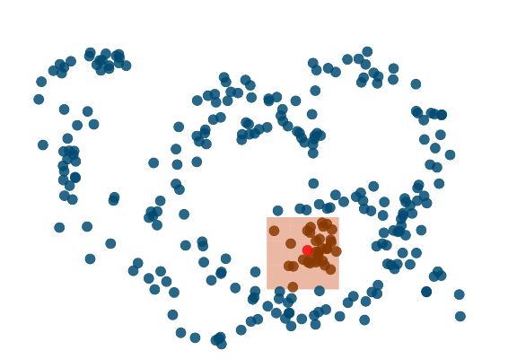

% Algoritmos y eficiencia
% Ale
% Hangar, 9-4-2015

# Referencias

**Repo de processing con los ejercicios**
[https://github.com/Ale-/codeup]()

**Presentación**
[http://workshops.wwb.cc/efficiency]()

# Algoritmos

## Qué son

Un algoritmo es la serie ordenada de instrucciones que permite describir de manera lógica un procedimiento. Aunque el nombre, proveniente del campo de las matemáticas, parece aludir a una componente matemática compleja, esto no tiene por qué ser necesariamente así. El análogo más cercano a un algoritmo puede ser el de una receta de cocina:

## Receta de una tortilla de patatas

1. Coge 6 huevos grandes
2. Coge 6 patatas pequeñas
3. Pela, corta y fríe las patatas
4. Echas los 6 huevos en un bol y bátelos
5. Mézclalo todo
6. Caliéntalo

```
//Una posible representación en código de la misma receta

int n = 6;
Huevo[] huevos = new Huevo[n];
Patata[] patatas = new Patata[n];
for(int i = 0; i < n; i++){
    peelAndSlice(patatas[i]);
    fry(patatas[i]);
}
ScrambledEggs mezcla = scramble(Huevos);
if( areFried(patatas) ) {
    cook( mix(patatas, mezcla) );
}

```

## En resumen

Un algoritmo es una serie ordenada de instrucciones, compuesta básicamente por expresiones condicionales (_if-else_, _while_...) e iteraciones (_for_, _foreach_...). Hacer buenos algoritmos tiene más que ver con la lógica, el sentido común y la capacidad de hacer modelos lógicos que con el conocimiento de las matemáticas tal y como se entienden cotidianemente (ecuaciones y esas cosas). 

# Eficiencia

## Intro

Para medir la eficiencia de cualquier algoritmo o instrucción, tenemos dos maneras. La primera es leer el framerate y la segunda (mejor) medir el tiempo total que toma ejecutarlo. Ambas soluciones son útiles en la medida que permiten comparar soluciones distintas:

```

//Ejemplo de cómo medir el tiempo de un algoritmo
println(frameRate());         //Primera manera
int start = millis();
uberAlgorithm();         
println( millis() - start );  //Segunda manera

```

Son pruebas muy básicas, aunque perfectamente válidas para nuestros intereses. Para medir correctamente la eficiencia de un programa o instrucción se usan programas o plugins especiales llamados _profilers_ que tienen en cuenta muchas más cosas y que ayudan a detectar los cuellos de botella.

## Coste de un algoritmo

El coste de un algoritmo se puede entender como la suma de los costes de las operaciones que éste comprende por su frecuencia y, lógicamente, es inversamente proporcional a su eficiencia. Esto quiere decir que **tenemos dos maneras de mejorar la eficiencia de un algoritmo**: reducir el coste de las operaciones o reducir su frecuencia. La primera entraría en lo que podríamos denominar _micro-optimización_, y la segunda sería el terreno de la optimización algorítmica propiamente dicha.

## Micro-eficiencia

Como ya hemos adelantado la micro-eficiencia tiene que ver con pequeñas mejoras en un algoritmo que generalmente lo que hacen es reducir la complejidad de las operaciones necesarias, o que hacen pequeños cambios *que no alteran el orden de complejidad de un algoritmo*.

Hay buenas prácticas en este sentido. Por ejemplo:

* Si repites el mismo cálculo continuamente, guárdalo en una variable. Si es un conjunto de valores usa una matriz (_lookup table_)
* Si tienes que comprobar varias condiciones en un único condicional, comprueba primero siempre la más barata.
* Si tienes que copiar los valores de una matriz, no iteres por la misma y usa _arrayCopy_, que funciona a bajo nivel y es mucho más rápida.
* Los Strings son objetos invariables. Esto significa que si cambias un String lo que haces es, realmente, generar otro nuevo. Si vas a estar trabajando con Strings mutables usa otras clases como StringBuffer o StringBuilder.

## Ejemplo(I). Micro-optimización. Lookup Tables.
_Lookup Tables_ (o LUT) es como se llama en programación a aquellas _tablas_ donde se guardan datos que se van a reusar durante el ciclo de vida de un programa. Este enfoque merece la pena cuando hay valores de cálculo costoso que se calculan continuamente durante la ejecución (en el _draw_ de processing, p.ej.). Aunque se llaman tablas, en la práctica suelen ser arrays (u otras estructuras de datos). Su uso por ejemplo: cachear un campo de fuerzas basado en _noise_, cachear cálculos trigonométricos, etc.

## Cuellos de botella

Los cuellos de botella son las peores secciones de un programa a efectos de eficiencia. **En processing, casi siempre, los cuellos de botella tienen que ver con la representación gráfica**. Esto significa que aunque haya mejoras evidentes en términos de micro-optimización, es probable que aplicando esas mejoras no consigamos ninguna mejora apreciable en la ejecución de nuestro programa. 
Por ejemplo: podemos cachear el resultado de una operación matemática para evitar realizarla 100 veces por segundo pero si además en cada frame dibujamos 3000 formas con transparencia, el ordenador tiene que calcular los píxeles resultantes y esa operación es tan cara que la otra es una mejora imperceptible.

# Orden de complejidad

## Definición

El orden de complejidad de un algoritmo (O) es la manera más usual de medir la frecuencia de operaciones que este realiza en función del número de inputs. Por ejemplo, un orden de complejidad lineal, _O(n)_, es aquel en el que el número de operaciones es directamente proporcional al número de elementos:

```

//Ejemplo de operación lineal O(n)
Elem[] elements = new Elem[500];
for(int i = 0; i < elements.length; i++)
    elements[i].doThat();

//Ejemplo de operación lineal O(5n)
Elem[] elements = new Elem[500];
for(int i = 0; i < elements.length; i++)
    for(int j = 0; j < 5; j++)
        elements[i].doThat();


```

## Los algoritmos de fuerza bruta

Los algoritmos de fuerza bruta son la manera más obvia de plantear la solución a un problema algorítmico y consisten en encontrar el resultado recorriendo todo el espacio de soluciones, siendo siempre la manera de complejidad teórica máxima de resolver un problema.

## Un ejemplo: búsqueda por fuerza bruta...

Vamos a plantear un ejemplo muy sencillo. Tenemos un array y queremos saber si contiene un determinado valor. La solución de fuerza bruta es la obvia, recorrer todo el espacio de soluciones (el array) y preguntarle a cada elemento si es el que buscamos:

```

float[] valores = new float[5000];
for(int i = 0; i < valores.length; i++) valores = random(5000);
//Queremos saber si en _valores_ existe el valor 5.2
for(int i = 0; i < valores.length; i++)
    if(valores[i] == 5.2) println("Eureka!");

```

En este caso el orden de complejidad es lineal ya que el número de operaciones es proporcional directamente al número de elementos. 

## ...y _binary search_. Orden de complejidad logarítmico. 

Pero hay una manera más inteligente de resolver este problema, llamado _búsqueda binaria_. Tenemos que ordenar la bolsa primero según el tipo de valor y después buscar éste, comprobando el valor que divide la bolsa por la mitad. Si el valor es mayor buscamos en la bolsa superior y desechamos la inferior (y viceversa). Este tipo de planteamientos que subdividen recurrentemente el espacio de soluciones por la mitad tienen un coste logarítmico _O(log n)_, ya que el logaritmo en base 2 de un número viene a representar el máximo número de veces que puedes dividir ese valor por la mitad. **Importante:** _en programación los logaritmos son en base 2_.
Evidentemente ordenar la bolsa tiene un coste que hay que tener en cuenta, pero si la bolsa no va a cambiar y vamos a estar continuamente buscando valores la mejora puede ser muy importante. Supongamos que tenemos que buscar en una base de datos de la población de China un determinado registro y que comprobar cada uno nos cuesta un milisegundo. En el peor de los casos (el registro no tiene coincidencias en la base) necesitaríamos un ordenador funcionando durante 16 días seguidos para recorrer todos los registros (1400 millones). Usando binary search gastaríamos un tiempo inicial en ordenar (que se puede minimizar usando una estructura de datos auto-ordenable como un _binary heap_), pero la comprobación habría que hacerla, a lo sumo unas 31 veces (el máximo número de veces que puedes dividir por dos 1400 millones). Es decir, tardaríamos medio segundo.

## Binary Search

_Implementación de Robert Sedgewick y Kevin Wayne_

```

public class BinarySearch
{
	public static int rank(int key, int[] a)
	{
		int lo = 0;
		int hi = a.length - 1;
		while (lo <= hi)
		{
			int mid = lo + (hi - lo) / 2;
			if      (key < a[mid]) hi = mid - 1;
			else if (key > a[mid]) lo = mid + 1;
			else                     return mid;
		}
		return -1;
	}
}

```

Importante: **nunca hay que reinventar la rueda**

## Orden de complejidad cuadrático. El NNS.

El orden de complejidad cuadrático O(n^2) empieza a ser un orden de complejidad alto. Muchos de los algoritmos clásicos transforman problemas que tienen un orden de complejidad cuadrático en un orden de complejidad _linearítmico_ O(n*log n).
Un ejemplo muy evidente es el algoritmo de búsqueda del vecino más cercano (_nearest neighbour search_ o NNS). En un algoritmo de este tipo recorremos todo el espacio de valores íntegramente por cada elemento para comprobar la distancia de todos los elementos entre sí:

```

//Ejemplo de NNS
Elem[] elements = new Elem[500];
for(int i = 0; i < elements.length; i++)
    for(int j = 0; j < elements.length; j++)
        if(i != j && elements[i].dist(elements[j]) < distance_treshold)
		doWhatever();

```

Este es un algoritmo clásico en gráfica generativa y es usado extensivamente, por ejemplo, por Casey Reas en sus procesos.

## Ejemplo(II). Optimización de un NNS.

En este ejemplo vamos a ver como podemos optimizar el algoritmo anterior, sin introducir ningún algoritmo especial, repasando varias técnicas de micro-optimización y reparando en un error habitual que se suele cometer en las iteraciones de los NNS.


# Reduciendo la complejidad del NNS. Hash-grids.

## Intro

Como hemos adelantado hay bastantes algoritmos clásicos que permiten reducir una complejidad cuadrática a un orden linearítmico (FFT que se usan en análisis de audio, el algoritmo de Dijkstra para saber el recorrido mínimo entre dos puntos, los algoritmos de búsqueda clásicos como el quicksort...). 
Ese es este caso, en el que vamos a usar un algoritmo de _space partitioning_, para reducir la complejidad cuadrática del algoritmo de búsqueda del vecino más cercano.
Los algoritmos de _space partitioning_ dividen el espacio, como indica su nombre, con la idea de deshechar a priori el máximo número de comparaciones de distancia. Los hash-grids son los más sencillos y tienen un enfoque particular que es el de ser los más eficientes cuando la distribución de elementos es más o menos homogénea.

## Funcionamiento

Un hash-grid es una rejilla ortogonal de cuadrados, que en el código llamaremos _buckets_. Esta rejilla está respaldada en una lista donde introducimos en cada frame a las partículas. De manera que es muy fácil saber en todo momento en que bucket se encuentra una partícula en concreto. Haremos la rejilla de manera que la distancia umbral que nos interesa comprobar sea como máximo del tamaño de los buckets. De esa manera sabemos que los vecinos de una partícula en concreto, estarán **siempre** en los buckets que rodean a la partícula en cuestión. De esa manera reducimos las comprobaciones de una partícula a todas las demás a de una partícula a todas las de los buckets que la rodean. Matemáticamente está comprobado que este acercamiento suele producir un orden de complejidad O(n log n). 

# Una imagen vale más que mil palabras



# Ejemplo(III). Hash-grids.
